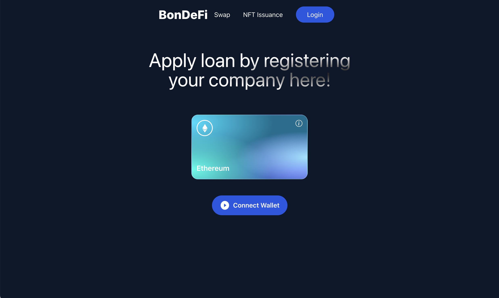
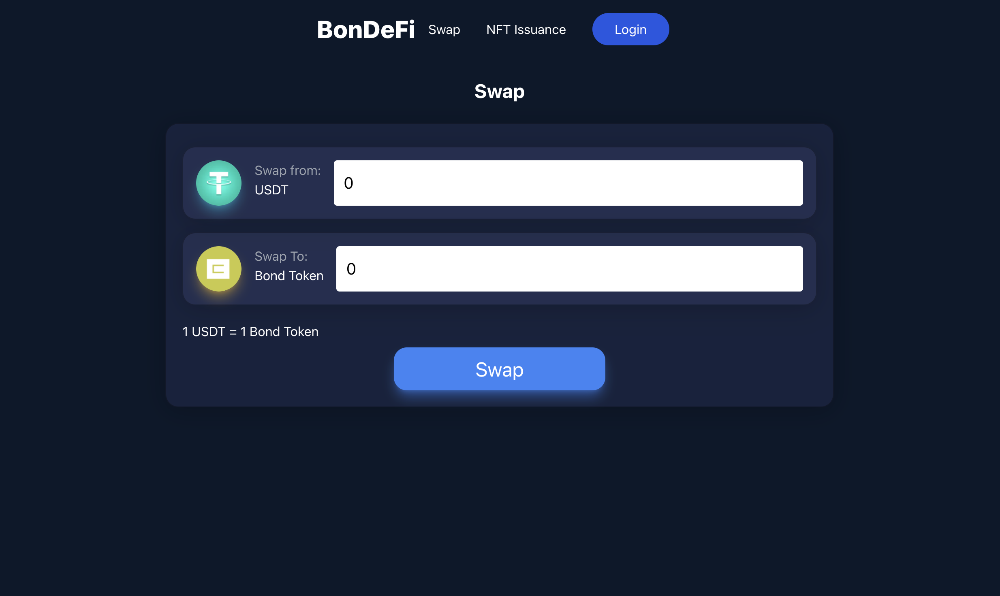
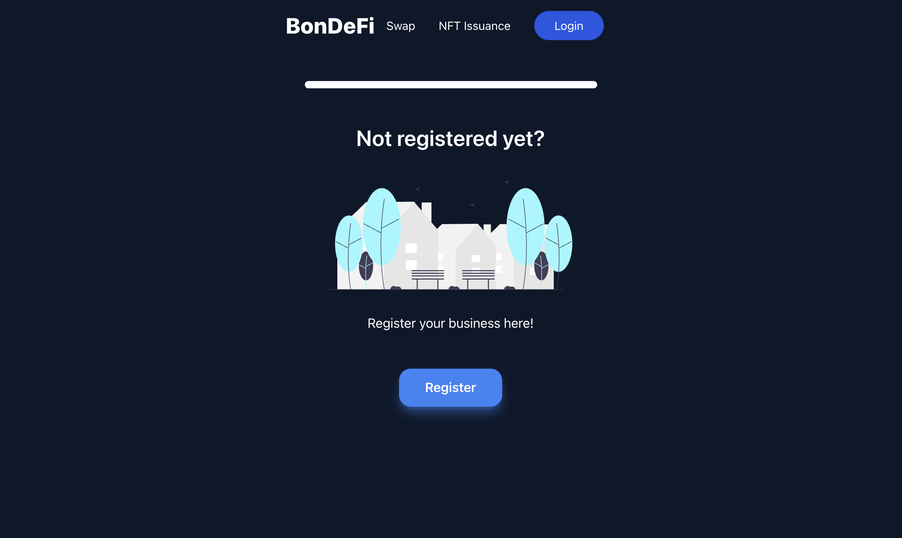
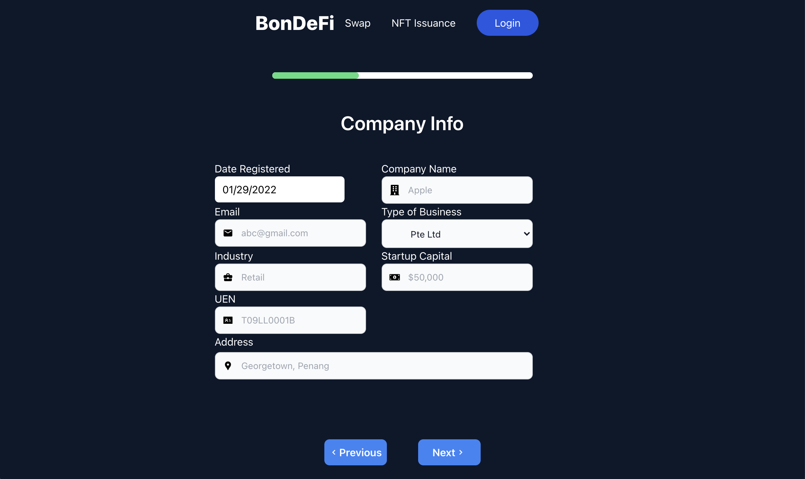
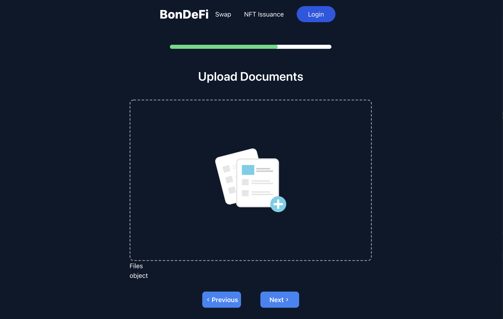
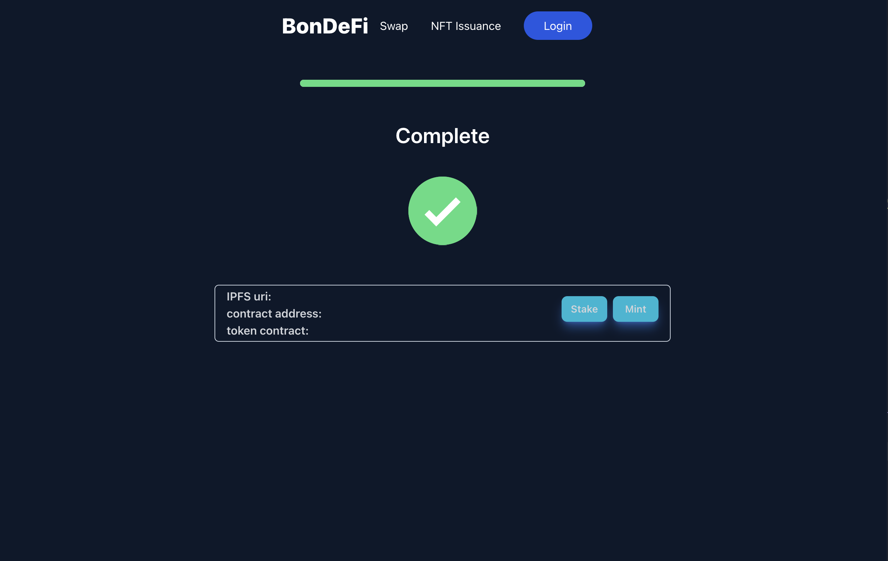

# BonDeFi

<!--TABLE OF CONTENTS-->
## Table Of Contents
  1. [Team](#team)
  2. [Problem Statement](#problem-statement)
  3. [Proposed Solution](#proposed-solution)
  4. [NFT Issuance Process](#nft-issuance-process)
  5. [Technologies Used](#technologies-used)
  6. [Outputs](#outputs)

<!--TEAM-->
## Team
No. | Team Member | Institution
--- | --- | ---
1 | XUE YAO | National University of Singapore
2 | ZHOU SHIKAI | National University of Singapore
3 | ELGENE EE | University Malaya

<!--PROBLEM STATEMENT-->
## Problem Statement
1. In traditional finance, when SMEs borrow loans, high interest rates are incurred. Banks are more conservative when loaning out money to new companies/startups.
2. High transactions fees, low interest rates, and limited selections of bonds for investors.

<!--PROPOSED SOLUTION-->
## Proposed Solution
1. DeFi - Connect borrowers and lenders through DeFi, cutting out financial institutions, providing better rates for both parties.
2. NFT - Collateral such as company's assets will be minted as NFT, investors are able to purchase NFT-backed bond tokens which will appreciate as the company pays back its loans.

<!--NFT issuance-->
## NFT Issuance Process
1. Company assets are evaluated by third party agencies.
2. NFT is generated along with the full company report.
3. NFT represents the company and is staked within the DApp.
   
<!--TECHNOLOGIES USED-->
## Technologies Used
- [ReactJS](https://reactjs.org)
- [TailwindCSS](https://tailwindcss.com)
- [Solidity](https://docs.soliditylang.org/en/v0.8.11/#)
- [HardHat](https://hardhat.org)
- [Web3](https://web3js.readthedocs.io/en/v1.7.0/)

<!--OUTPUTS-->
## Outputs

Landing Page

    

Swap

    

NFT Issuance

    

    

    

    

